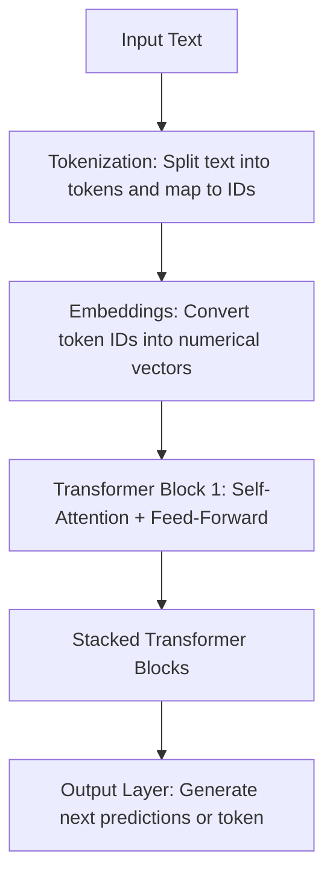

# Understanding LLMs

In large language models, tokens are the basic units of text that the model understands, which can be a word, part of a word, or a single character. These tokens are assigned a unique identifier that maps to the original. Each token is converted into numbers and represented as a vector embedding, which is simply a numerical way of storing meaning. Embeddings allow the model to compare the tokens as an array of numbers so similar words or phrases end up closer together in the vector space.

The core part of LLMs is the transformer block. Each block contains a self-attention mechanism, which lets the model weigh the importance of token or word representations in the input sequence to better understand the relationship between them. Self-attention works by comparing each token representation to all others in the sequence using queries, keys, and values, and combining them into a context-aware representation. After attention, the block passes the token representations through a small feed-forward network to refine them before sending them to the next block. By stacking many transformer blocks, the model builds a rich understanding of the text, which is then used to generate outputs such as predicting the next word or completing a sentence.

### Simple flow diagram

 
